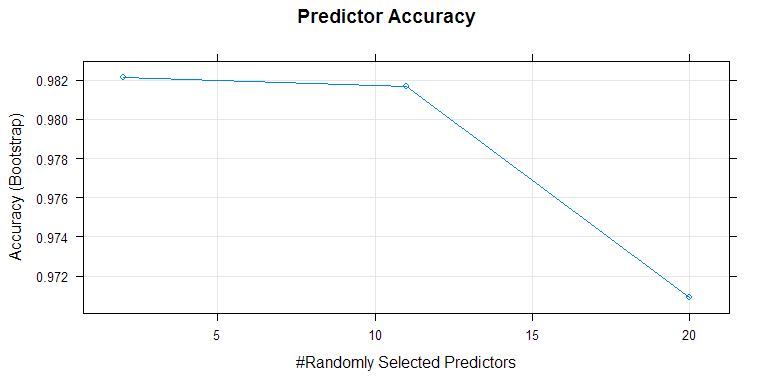

# Predicting Dumbbell Curls From Wearable Accelerometers
Jay Lillico  
August 24 2014  

<style type="text/css">
table {
     max-width: 95%;
     border: 1px solid #ccc;
}

th {
     
     background-color: #000000;
     color: #ffffff;
     border: 1px solid white;
}

td {
  background-color: #BBBBBB;
  border: 1px solid white;
}
</style>

## Synopsis


In this report, we examine readings from wearable accelerometers on six subjects performing dumbell curls.  Each subject performed one set of 10 dumbbell lift in 5 different manners; one correctly, and four others performed in a common incorrect manner.   From the accelerometers' readings, we will try to predict the type of lift that was performed.


## Data Processing


From the [Human Activity Recognition Website](http://groupware.les.inf.puc-rio.br/har) we get data on experiments on weight lifting (more specifically this [link](https://d396qusza40orc.cloudfront.net/predmachlearn/pml-training.csv)). Specifically, sensors were placed at four different locations: arm, forearm, belt and dumbbell.


```
## randomForest 4.6-10
## Type rfNews() to see new features/changes/bug fixes.
## 
## Attaching package: 'psych'
## 
## The following object is masked from 'package:ggplot2':
## 
##     %+%
## 
## The following object is masked from 'package:randomForest':
## 
##     outlier
```


###Reading In Data


Data is in a .csv file.  We read the data into a data frame. Data that is blank (empty, NA) or invalid (DIV/0) are converted to NAs


### Data Slicing
We first split the data of 19622 observations in two sets.  A training set consisting of 60% of the data, and a testing set holding 40% of the data.  The testing set will be set aside to test the final model


###Preprocessing Data

After reading in the data, we note that out of the 160 variables, there are numerous columns that contain less than around 400 observations (i.e. NA) out of the full 19622 observations.  Therefore, we'll remove these variables from our data set, to avoid the more sparse observations overfitting our prediction.  For full details, view Appendix 1.

We also remove columns that are not of apredictive nature (timestamps, names, windows, indexes).  Finally, we run a single Random Forest model to determine the most important variables.  We choose those with a Mean Decrease in Gini index of greater than 160, so that we end up with close to 20 variables.  See Appendix 2 for more details


##Modelling Data

We use a Random Forest to model our data.  We feel this is the best fit for the size and classification of our data. We also take advantage that cross validation is done in the Random Forest library. A summary of the model can be seen below. We estimate our out of sample error rate to be 1.29%.


```
## 
## Call:
##  randomForest(x = x, y = y, mtry = param$mtry) 
##                Type of random forest: classification
##                      Number of trees: 500
## No. of variables tried at each split: 2
## 
##         OOB estimate of  error rate: 1.29%
## Confusion matrix:
##      A    B    C    D    E class.error
## A 3335   12    0    1    0    0.003883
## B   25 2227   26    1    0    0.022817
## C    0   26 2017   11    0    0.018014
## D    1    0   33 1894    2    0.018653
## E    0    1    4    9 2151    0.006467
```

###Testing Model

we use our testing data set to check our model.  We alter the testing data set in the same manner as the training set.


###Results
As we see below, the test on our model shows an accuracy rate of 98.84% and  an out of sample error rate of 1.16% on our test data set.


```
## Confusion Matrix and Statistics
## 
##           Reference
## Prediction    A    B    C    D    E
##          A 2221   17    0    0    0
##          B    6 1487   14    1    0
##          C    1   12 1351   25    2
##          D    3    2    3 1259    3
##          E    1    0    0    1 1437
## 
## Overall Statistics
##                                         
##                Accuracy : 0.988         
##                  95% CI : (0.986, 0.991)
##     No Information Rate : 0.284         
##     P-Value [Acc > NIR] : <2e-16        
##                                         
##                   Kappa : 0.985         
##  Mcnemar's Test P-Value : NA            
## 
## Statistics by Class:
## 
##                      Class: A Class: B Class: C Class: D Class: E
## Sensitivity             0.995    0.980    0.988    0.979    0.997
## Specificity             0.997    0.997    0.994    0.998    1.000
## Pos Pred Value          0.992    0.986    0.971    0.991    0.999
## Neg Pred Value          0.998    0.995    0.997    0.996    0.999
## Prevalence              0.284    0.193    0.174    0.164    0.184
## Detection Rate          0.283    0.190    0.172    0.160    0.183
## Detection Prevalence    0.285    0.192    0.177    0.162    0.183
## Balanced Accuracy       0.996    0.988    0.991    0.989    0.998
```

And finally, some plots to show the accuracy of our predictors, and the error rate of our model as the number of trees increased.

  

##Appendix

###Appendix 1 Description Of Training Data Set Before Processing


|                         | variable #| n.obs| type|H1               |T1               |
|:------------------------|----------:|-----:|----:|:----------------|:----------------|
|X                        |          1| 19622|    1|1                |19622            |
|user_name*               |          2| 19622|    3|carlitos         |adelmo           |
|raw_timestamp_part_1     |          3| 19622|    1|1323084231       |1322832937       |
|raw_timestamp_part_2     |          4| 19622|    1|788290           |972293           |
|cvtd_timestamp*          |          5| 19622|    3|05/12/2011 11:23 |02/12/2011 13:35 |
|new_window*              |          6| 19622|    3|no               |yes              |
|num_window               |          7| 19622|    1|11               |864              |
|roll_belt                |          8| 19622|    1|1.41             |143              |
|pitch_belt               |          9| 19622|    1|8.07             |-36              |
|yaw_belt                 |         10| 19622|    1|-94.4            |132              |
|total_accel_belt         |         11| 19622|    1|3                |18               |
|kurtosis_roll_belt       |         12|   396|    1|NA               |-1.176           |
|kurtosis_picth_belt      |         13|   374|    1|NA               |-1.063           |
|kurtosis_yaw_belt*       |         14|     0|    2|NA               |NA               |
|skewness_roll_belt       |         15|   397|    1|NA               |0.1969           |
|skewness_roll_belt.1     |         16|   374|    1|NA               |-0.5724          |
|skewness_yaw_belt*       |         17|     0|    2|NA               |NA               |
|max_roll_belt            |         18|   406|    1|NA               |132              |
|max_picth_belt           |         19|   406|    1|NA               |25               |
|max_yaw_belt             |         20|   396|    1|NA               |-1.2             |
|min_roll_belt            |         21|   406|    1|NA               |123              |
|min_pitch_belt           |         22|   406|    1|NA               |18               |
|min_yaw_belt             |         23|   396|    1|NA               |-1.2             |
|amplitude_roll_belt      |         24|   406|    1|NA               |9                |
|amplitude_pitch_belt     |         25|   406|    1|NA               |7                |
|amplitude_yaw_belt       |         26|   396|    1|NA               |0                |
|var_total_accel_belt     |         27|   406|    1|NA               |5.627            |
|avg_roll_belt            |         28|   406|    1|NA               |151.1            |
|stddev_roll_belt         |         29|   406|    1|NA               |4.753            |
|var_roll_belt            |         30|   406|    1|NA               |22.59            |
|avg_pitch_belt           |         31|   406|    1|NA               |-33.63           |
|stddev_pitch_belt        |         32|   406|    1|NA               |1.395            |
|var_pitch_belt           |         33|   406|    1|NA               |1.947            |
|avg_yaw_belt             |         34|   406|    1|NA               |126.9            |
|stddev_yaw_belt          |         35|   406|    1|NA               |2.75             |
|var_yaw_belt             |         36|   406|    1|NA               |7.564            |
|gyros_belt_x             |         37| 19622|    1|0                |0.35             |
|gyros_belt_y             |         38| 19622|    1|0                |-0.02            |
|gyros_belt_z             |         39| 19622|    1|-0.02            |-0.57            |
|accel_belt_x             |         40| 19622|    1|-21              |42               |
|accel_belt_y             |         41| 19622|    1|4                |25               |
|accel_belt_z             |         42| 19622|    1|22               |-171             |
|magnet_belt_x            |         43| 19622|    1|-3               |194              |
|magnet_belt_y            |         44| 19622|    1|599              |566              |
|magnet_belt_z            |         45| 19622|    1|-313             |-349             |
|roll_arm                 |         46| 19622|    1|-128             |-97.6            |
|pitch_arm                |         47| 19622|    1|22.5             |-37.7            |
|yaw_arm                  |         48| 19622|    1|-161             |71.5             |
|total_accel_arm          |         49| 19622|    1|34               |41               |
|var_accel_arm            |         50|   406|    1|NA               |54.26            |
|avg_roll_arm             |         51|   406|    1|NA               |-91.65           |
|stddev_roll_arm          |         52|   406|    1|NA               |9.169            |
|var_roll_arm             |         53|   406|    1|NA               |84.06            |
|avg_pitch_arm            |         54|   406|    1|NA               |-37.65           |
|stddev_pitch_arm         |         55|   406|    1|NA               |3.616            |
|var_pitch_arm            |         56|   406|    1|NA               |13.08            |
|avg_yaw_arm              |         57|   406|    1|NA               |66.31            |
|stddev_yaw_arm           |         58|   406|    1|NA               |15.48            |
|var_yaw_arm              |         59|   406|    1|NA               |239.6            |
|gyros_arm_x              |         60| 19622|    1|0                |1.51             |
|gyros_arm_y              |         61| 19622|    1|0                |-1.06            |
|gyros_arm_z              |         62| 19622|    1|-0.02            |0.59             |
|accel_arm_x              |         63| 19622|    1|-288             |58               |
|accel_arm_y              |         64| 19622|    1|109              |-152             |
|accel_arm_z              |         65| 19622|    1|-123             |-365             |
|magnet_arm_x             |         66| 19622|    1|-368             |362              |
|magnet_arm_y             |         67| 19622|    1|337              |-84              |
|magnet_arm_z             |         68| 19622|    1|516              |-539             |
|kurtosis_roll_arm        |         69|   328|    1|NA               |-1.326           |
|kurtosis_picth_arm       |         70|   326|    1|NA               |0.5096           |
|kurtosis_yaw_arm         |         71|   395|    1|NA               |-0.6274          |
|skewness_roll_arm        |         72|   329|    1|NA               |-0.5172          |
|skewness_pitch_arm       |         73|   326|    1|NA               |-1.269           |
|skewness_yaw_arm         |         74|   395|    1|NA               |-0.7715          |
|max_roll_arm             |         75|   406|    1|NA               |-33.7            |
|max_picth_arm            |         76|   406|    1|NA               |79.5             |
|max_yaw_arm              |         77|   406|    1|NA               |49               |
|min_roll_arm             |         78|   406|    1|NA               |-43.5            |
|min_pitch_arm            |         79|   406|    1|NA               |27.5             |
|min_yaw_arm              |         80|   406|    1|NA               |25               |
|amplitude_roll_arm       |         81|   406|    1|NA               |9.8              |
|amplitude_pitch_arm      |         82|   406|    1|NA               |52               |
|amplitude_yaw_arm        |         83|   406|    1|NA               |24               |
|roll_dumbbell            |         84| 19622|    1|13.05            |20.8             |
|pitch_dumbbell           |         85| 19622|    1|-70.49           |-19.7            |
|yaw_dumbbell             |         86| 19622|    1|-84.87           |-128.2           |
|kurtosis_roll_dumbbell   |         87|   401|    1|NA               |-1.132           |
|kurtosis_picth_dumbbell  |         88|   404|    1|NA               |-0.7225          |
|kurtosis_yaw_dumbbell*   |         89|     0|    2|NA               |NA               |
|skewness_roll_dumbbell   |         90|   402|    1|NA               |0.0955           |
|skewness_pitch_dumbbell  |         91|   405|    1|NA               |0.1057           |
|skewness_yaw_dumbbell*   |         92|     0|    2|NA               |NA               |
|max_roll_dumbbell        |         93|   406|    1|NA               |-19.7            |
|max_picth_dumbbell       |         94|   406|    1|NA               |-92              |
|max_yaw_dumbbell         |         95|   401|    1|NA               |-1.1             |
|min_roll_dumbbell        |         96|   406|    1|NA               |-33.1            |
|min_pitch_dumbbell       |         97|   406|    1|NA               |-128.2           |
|min_yaw_dumbbell         |         98|   401|    1|NA               |-1.1             |
|amplitude_roll_dumbbell  |         99|   406|    1|NA               |13.41            |
|amplitude_pitch_dumbbell |        100|   406|    1|NA               |36.2             |
|amplitude_yaw_dumbbell   |        101|   401|    1|NA               |0                |
|total_accel_dumbbell     |        102| 19622|    1|37               |19               |
|var_accel_dumbbell       |        103|   406|    1|NA               |0.4217           |
|avg_roll_dumbbell        |        104|   406|    1|NA               |37.34            |
|stddev_roll_dumbbell     |        105|   406|    1|NA               |9.783            |
|var_roll_dumbbell        |        106|   406|    1|NA               |95.7             |
|avg_pitch_dumbbell       |        107|   406|    1|NA               |-26.82           |
|stddev_pitch_dumbbell    |        108|   406|    1|NA               |4.01             |
|var_pitch_dumbbell       |        109|   406|    1|NA               |16.08            |
|avg_yaw_dumbbell         |        110|   406|    1|NA               |-110             |
|stddev_yaw_dumbbell      |        111|   406|    1|NA               |9.748            |
|var_yaw_dumbbell         |        112|   406|    1|NA               |95.01            |
|gyros_dumbbell_x         |        113| 19622|    1|0                |0.02             |
|gyros_dumbbell_y         |        114| 19622|    1|-0.02            |0.02             |
|gyros_dumbbell_z         |        115| 19622|    1|0                |0.36             |
|accel_dumbbell_x         |        116| 19622|    1|-234             |-36              |
|accel_dumbbell_y         |        117| 19622|    1|47               |38               |
|accel_dumbbell_z         |        118| 19622|    1|-271             |-176             |
|magnet_dumbbell_x        |        119| 19622|    1|-559             |-627             |
|magnet_dumbbell_y        |        120| 19622|    1|293              |119              |
|magnet_dumbbell_z        |        121| 19622|    1|-65              |2                |
|roll_forearm             |        122| 19622|    1|28.4             |0                |
|pitch_forearm            |        123| 19622|    1|-63.9            |0                |
|yaw_forearm              |        124| 19622|    1|-153             |0                |
|kurtosis_roll_forearm    |        125|   322|    1|NA               |NA               |
|kurtosis_picth_forearm   |        126|   321|    1|NA               |NA               |
|kurtosis_yaw_forearm*    |        127|     0|    2|NA               |NA               |
|skewness_roll_forearm    |        128|   323|    1|NA               |NA               |
|skewness_pitch_forearm   |        129|   321|    1|NA               |NA               |
|skewness_yaw_forearm*    |        130|     0|    2|NA               |NA               |
|max_roll_forearm         |        131|   406|    1|NA               |0                |
|max_picth_forearm        |        132|   406|    1|NA               |0                |
|max_yaw_forearm          |        133|   322|    1|NA               |NA               |
|min_roll_forearm         |        134|   406|    1|NA               |0                |
|min_pitch_forearm        |        135|   406|    1|NA               |0                |
|min_yaw_forearm          |        136|   322|    1|NA               |NA               |
|amplitude_roll_forearm   |        137|   406|    1|NA               |0                |
|amplitude_pitch_forearm  |        138|   406|    1|NA               |0                |
|amplitude_yaw_forearm    |        139|   322|    1|NA               |NA               |
|total_accel_forearm      |        140| 19622|    1|36               |33               |
|var_accel_forearm        |        141|   406|    1|NA               |30.11            |
|avg_roll_forearm         |        142|   406|    1|NA               |0                |
|stddev_roll_forearm      |        143|   406|    1|NA               |0                |
|var_roll_forearm         |        144|   406|    1|NA               |0                |
|avg_pitch_forearm        |        145|   406|    1|NA               |0                |
|stddev_pitch_forearm     |        146|   406|    1|NA               |0                |
|var_pitch_forearm        |        147|   406|    1|NA               |0                |
|avg_yaw_forearm          |        148|   406|    1|NA               |0                |
|stddev_yaw_forearm       |        149|   406|    1|NA               |0                |
|var_yaw_forearm          |        150|   406|    1|NA               |0                |
|gyros_forearm_x          |        151| 19622|    1|0.03             |1.38             |
|gyros_forearm_y          |        152| 19622|    1|0                |-0.64            |
|gyros_forearm_z          |        153| 19622|    1|-0.02            |0.08             |
|accel_forearm_x          |        154| 19622|    1|192              |-278             |
|accel_forearm_y          |        155| 19622|    1|203              |-159             |
|accel_forearm_z          |        156| 19622|    1|-215             |-52              |
|magnet_forearm_x         |        157| 19622|    1|-17              |-60              |
|magnet_forearm_y         |        158| 19622|    1|654              |-686             |
|magnet_forearm_z         |        159| 19622|    1|476              |-110             |
|classe*                  |        160| 19622|    3|A                |E                |

###Appendix 2 Description Of Importance Of Predictors


|                     |      A|      B|      C|      D|      E| MeanDecreaseAccuracy| MeanDecreaseGini|
|:--------------------|------:|------:|------:|------:|------:|--------------------:|----------------:|
|roll_belt            | 0.0739| 0.0959| 0.1158| 0.1290| 0.1865|               0.1151|         719.8752|
|pitch_belt           | 0.0793| 0.1197| 0.0983| 0.1004| 0.0370|               0.0861|         411.1764|
|yaw_belt             | 0.1111| 0.0903| 0.1149| 0.1446| 0.0595|               0.1037|         518.5995|
|total_accel_belt     | 0.0175| 0.0220| 0.0256| 0.0210| 0.0210|               0.0210|         132.5179|
|gyros_belt_x         | 0.0141| 0.0088| 0.0188| 0.0118| 0.0044|               0.0117|          58.7196|
|gyros_belt_y         | 0.0093| 0.0129| 0.0191| 0.0157| 0.0063|               0.0122|          63.5377|
|gyros_belt_z         | 0.0245| 0.0359| 0.0412| 0.0387| 0.0306|               0.0331|         188.6099|
|accel_belt_x         | 0.0143| 0.0173| 0.0219| 0.0161| 0.0073|               0.0152|          66.9207|
|accel_belt_y         | 0.0160| 0.0200| 0.0255| 0.0316| 0.0121|               0.0203|          82.6509|
|accel_belt_z         | 0.0296| 0.0379| 0.0500| 0.0398| 0.0365|               0.0377|         224.8569|
|magnet_belt_x        | 0.0177| 0.0298| 0.0422| 0.0344| 0.0163|               0.0268|         141.9970|
|magnet_belt_y        | 0.0341| 0.0520| 0.0522| 0.0624| 0.0461|               0.0475|         234.8605|
|magnet_belt_z        | 0.0441| 0.0618| 0.0639| 0.0772| 0.0502|               0.0575|         254.5512|
|roll_arm             | 0.0240| 0.0358| 0.0518| 0.0588| 0.0200|               0.0361|         181.6139|
|pitch_arm            | 0.0164| 0.0214| 0.0209| 0.0233| 0.0113|               0.0183|         102.3988|
|yaw_arm              | 0.0244| 0.0191| 0.0265| 0.0276| 0.0115|               0.0219|         148.3881|
|total_accel_arm      | 0.0082| 0.0075| 0.0114| 0.0133| 0.0065|               0.0092|          62.3596|
|gyros_arm_x          | 0.0190| 0.0131| 0.0074| 0.0120| 0.0057|               0.0122|          81.4740|
|gyros_arm_y          | 0.0126| 0.0156| 0.0071| 0.0134| 0.0056|               0.0111|          85.4105|
|gyros_arm_z          | 0.0055| 0.0047| 0.0043| 0.0042| 0.0038|               0.0046|          39.3947|
|accel_arm_x          | 0.0433| 0.0331| 0.0336| 0.0560| 0.0237|               0.0381|         149.0164|
|accel_arm_y          | 0.0191| 0.0202| 0.0181| 0.0189| 0.0096|               0.0174|          95.6408|
|accel_arm_z          | 0.0178| 0.0114| 0.0172| 0.0106| 0.0066|               0.0132|          78.4500|
|magnet_arm_x         | 0.0651| 0.0433| 0.0453| 0.0718| 0.0340|               0.0528|         158.8800|
|magnet_arm_y         | 0.0279| 0.0332| 0.0370| 0.0502| 0.0236|               0.0333|         139.1993|
|magnet_arm_z         | 0.0238| 0.0210| 0.0178| 0.0149| 0.0087|               0.0180|         108.6937|
|roll_dumbbell        | 0.0405| 0.0774| 0.1071| 0.0884| 0.0483|               0.0685|         267.5199|
|pitch_dumbbell       | 0.0180| 0.0314| 0.0438| 0.0295| 0.0216|               0.0276|         112.8729|
|yaw_dumbbell         | 0.0300| 0.0339| 0.0569| 0.0421| 0.0278|               0.0370|         147.6205|
|total_accel_dumbbell | 0.0358| 0.0326| 0.0396| 0.0560| 0.0271|               0.0375|         166.8152|
|gyros_dumbbell_x     | 0.0050| 0.0146| 0.0177| 0.0121| 0.0076|               0.0107|          80.7007|
|gyros_dumbbell_y     | 0.0259| 0.0291| 0.0413| 0.0267| 0.0163|               0.0276|         155.9020|
|gyros_dumbbell_z     | 0.0031| 0.0069| 0.0048| 0.0065| 0.0045|               0.0049|          50.0426|
|accel_dumbbell_x     | 0.0322| 0.0359| 0.0550| 0.0429| 0.0255|               0.0374|         160.2365|
|accel_dumbbell_y     | 0.0422| 0.0560| 0.1030| 0.0623| 0.0428|               0.0589|         252.3465|
|accel_dumbbell_z     | 0.0356| 0.0436| 0.0663| 0.0631| 0.0461|               0.0489|         206.9333|
|magnet_dumbbell_x    | 0.0957| 0.0751| 0.1269| 0.1051| 0.0509|               0.0904|         288.9972|
|magnet_dumbbell_y    | 0.0965| 0.1096| 0.1587| 0.1487| 0.0553|               0.1108|         399.1059|
|magnet_dumbbell_z    | 0.1332| 0.0981| 0.1504| 0.1245| 0.0633|               0.1151|         466.4318|
|roll_forearm         | 0.1286| 0.0855| 0.1668| 0.1065| 0.0630|               0.1112|         347.3331|
|pitch_forearm        | 0.1029| 0.0559| 0.0771| 0.1200| 0.0495|               0.0822|         470.5938|
|yaw_forearm          | 0.0139| 0.0143| 0.0227| 0.0370| 0.0115|               0.0189|          97.3126|
|total_accel_forearm  | 0.0152| 0.0086| 0.0117| 0.0105| 0.0047|               0.0106|          70.0865|
|gyros_forearm_x      | 0.0038| 0.0068| 0.0096| 0.0111| 0.0033|               0.0065|          49.8644|
|gyros_forearm_y      | 0.0089| 0.0127| 0.0080| 0.0101| 0.0048|               0.0089|          73.9989|
|gyros_forearm_z      | 0.0046| 0.0096| 0.0057| 0.0045| 0.0029|               0.0054|          54.9785|
|accel_forearm_x      | 0.0434| 0.0399| 0.0439| 0.0800| 0.0322|               0.0467|         182.4060|
|accel_forearm_y      | 0.0230| 0.0143| 0.0249| 0.0160| 0.0095|               0.0180|          90.4037|
|accel_forearm_z      | 0.0230| 0.0265| 0.0499| 0.0385| 0.0235|               0.0310|         146.0369|
|magnet_forearm_x     | 0.0347| 0.0179| 0.0260| 0.0384| 0.0224|               0.0283|         143.1043|
|magnet_forearm_y     | 0.0228| 0.0202| 0.0310| 0.0291| 0.0174|               0.0238|         129.0239|
|magnet_forearm_z     | 0.0268| 0.0251| 0.0390| 0.0382| 0.0202|               0.0292|         169.7277|

